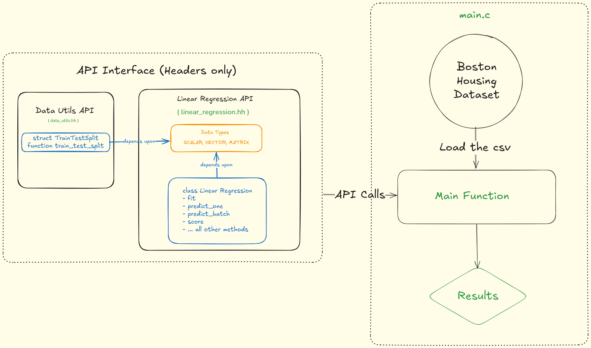

# 🧠 Linear Regression from Scratch in C++

This project implements **Linear Regression from scratch in C++**, without using any machine learning libraries. The goal is purely educational — to understand the inner workings of linear regression, gradient descent, data processing, and performance evaluation from first principles.

> 📚 This was a self-learning exercise to brush up on linear regression concepts, C++ programming, and numerical optimization.

---

## 🚀 Features

- Implements **Batch Gradient Descent** for training
- Handles **multivariate input**
- Supports:
  - Prediction (`predict_one`, `predict_batch`)
  - R² score evaluation
  - Mean Squared Error (MSE)
- Data Standardization (manual feature scaling)
- CSV parsing via [Ben Strasser’s `csv.h`](https://github.com/ben-strasser/fast-cpp-csv-parser)
- Includes a working training/testing pipeline using the **Boston Housing Dataset**

---

## 🧰 File Structure

```

.
├── assets/ # Diagrams/images
├── include/ # Header files (modular design)
├── src/ # Source files (implementation)
├── HousingData.csv # Dataset (Boston Housing)
├── main.cpp # Entry point (model training & evaluation)
├── Makefile # Build file
├── LICENSE # MIT License
└── README.md # This file

```

---

## 📊 Dataset

This project uses the [**Boston Housing Dataset**](https://www.kaggle.com/datasets/altavish/boston-housing-dataset) published by **Vish Vishal** on Kaggle.

- 506 samples, 13 numerical features, 1 target (`MEDV`: Median home value)
- Original source: UCI ML Repository

---

## 🛠️ Build Instructions

### 🔧 Requirements

- C++17 compiler (e.g., `g++`)
- Make

### 🧪 To Build and Run:

```bash
make           # builds the executable
./linear_regression   # runs the program
```

This will:

- Load the `HousingData.csv`
- Preprocess and standardize the data
- Train a Linear Regression model from scratch
- Print:

  - First 10 predictions vs actual values
  - R² score
  - MSE on test set

---

## ✅ Sample Output

```
Loaded 506 samples with 13 features

First 10 Predictions vs Actual:
Pred: 21.8067 | Actual: 21.7
Pred: 26.1933 | Actual: 22.8
...

R^2 score on test data: 0.788858
MSE on test data: 15.0164
```

---

## 🧩 Code Highlights

### `linear_regression.hh`

Defines the `LinearRegression` class:

```cpp
void fit(const MATRIX& X, const VECTOR& y, size_t log_every = 100);
VECTOR predict_batch(const MATRIX& X) const;
double score(const MATRIX& X, const VECTOR& y) const;  // R²
double compute_loss(const MATRIX& X, const VECTOR& y) const; // MSE
```

### `main.cpp`

Implements:

- Data loading
- Standardization
- Model training & evaluation

---

## 🙏 Attributions

- **CSV Parsing Library**:
  [`csv.h`](https://github.com/ben-strasser/fast-cpp-csv-parser)
  _Copyright (c) 2012-2015
  Ben Strasser [code@ben-strasser.net](mailto:code@ben-strasser.net)_

- **Dataset**:
  [Boston Housing Dataset](https://www.kaggle.com/datasets/altavish/boston-housing-dataset)
  By Vish Vishal on Kaggle (Updated 8 years ago)

---

## 📜 License

This project is licensed under the [MIT License](./LICENSE).

Feel free to use, modify, and share — this is for educational purposes only.

---

## ✍️ Author

**Vivek Kumar**
_Student, Learner, Experimenter_

---

## 📷 Screenshots

<p align="center">
  
</p>

---

## 🤔 Future Ideas

- Add support for L2 (Ridge) and L1 (Lasso) regularization
- Save and load model weights
- Implement stochastic or mini-batch gradient descent
- Visualize loss curve over epochs

---
